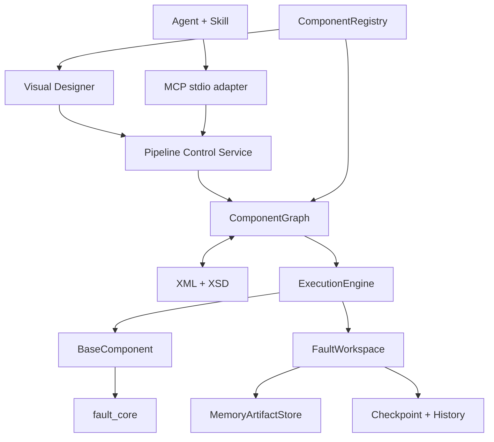

# 架构与实现约定

本项目依据 `核心提示词/提示词1+2.md` 的产品描述实现。文档中的角色提示和对话步骤是背景材料；交付内容是可运行工程。

| 对象 | 职责、字段与主要操作 |
| --- | --- |
| Fault Core | 独立数值计算；不导入平台对象 |
| BaseComponent | component_id、metadata、parameters；声明端口和 ParameterDefinition；validate / execute / reset / serialize / deserialize |
| InputPort / OutputPort | name、data_type、required；严格类型匹配，运行时检查真实对象 |
| ParameterDefinition | type、default、required、min/max、options、allow_multiple；参数验证及 UI 表单 |
| ComponentMetadata | type、名称、category、subcategory、version、tags、description |
| ComponentRegistry | 注册实现类；register / unregister / get / list / search / filter；UI、MCP 共用 schema |
| ComponentNode | 组件实例、position、UI 信息；无运行数据 |
| Connection | source_node / source_port / target_node / target_port；单输入最多一条边 |
| ComponentGraph | nodes、edges、metadata、version；增删、连接、循环检测、拓扑排序、克隆、序列化 |
| FaultWorkspace | 输出 artifact 引用、状态、错误、历史、指纹；有界预览 |
| WorkspaceManager | 创建、查询、重置、删除 Workspace、内存检查点；检查 pipeline 归属 |
| ExecutionContext | workspace、data_root、取消信号；输入路径和资源配置 |
| ExecutionEngine | 校验、DAG 调度、输入解析、执行、输出存储、失败传播、增量失效 |
| XML | graph 持久化；JSON 编码参数保留类型；XSD 结构验证及 Registry 语义验证 |
| PipelineService | UI / MCP 共用；执行 graph 快照；拒绝运行中的编辑 |
| Visual Designer | 动态组件库、SVG 连线、参数、状态、有界结果；无数值算法 |
| MCP | 高层控制工具；通过本地 HTTP 操作同一 Graph / Workspace |
| Skill | 指导探索、特征、验证方案；不计算数据 |

Graph 保存配置；Workspace 的 ArtifactStore 保存真实数据。端口解析输出，组件不持有相邻组件。输入读取和输出存储复制数据，避免分支污染。首版串行 DAG 调度，独立分支在其他节点失败后继续。

执行前检查参数、端口、必需输入、循环与数据源。动态列、标签在组件运行时检查。FAILED 的下游为 SKIPPED；错误保存类型、message、stack、参数、输入摘要。单节点执行需要有效上游缓存；从节点执行包括所有后继。修改配置、边、数据内容使相关节点及后继失效。

Checkpoint 保存 graph 快照、状态、artifact 数据和历史的独立内存副本。恢复时一起恢复 graph；进程退出后 Workspace / Checkpoint 不保留。XML 可保存到磁盘重新导入。

数据类型：Dataset、TimeSeries、FeatureDataset、CorrelationMatrix、Prediction、FeatureImportance 为 DataFrame；LabelVector 为 Series；FeatureTransformer 为带 transform 的已拟合对象；StatisticsResult、Metrics、Visualization、PlotArtifact、GenericArtifact 为结构化对象；Model 为带 predict 的训练对象。不同端口类型不隐式互转。PlotArtifact 使用有界 JSON 图形规格。

特征窗口保留唯一索引、原始行覆盖范围与设备分组；标签按同一窗口生成，混合标签默认拒绝，可选最后标签或众数。合并要求索引及窗口来源完全一致。模型严格验证特征与标签索引。频域特征复用同一窗口切分和标签策略，只增加采样率、频带边界与谐波容差参数。

特征评分选择（fault_core.selection）与主成分分析（fault_core.reduction）输入 FeatureDataset，输出保持索引、窗口来源和属性，因此仍可与其它分支合并或进入分组/时间验证。选择与降维在全部行上拟合，因此附加探索性提示；监督方法要求标签索引对齐。

分类特征由 `feature.categorical` 拟合并输出 FeatureTransformer，`feature.categorical_transform` 对新数据复用同一词表、映射和输出顺序。编码器随 FeatureDataset 来源传入验证器并嵌入 Model，未知类别按训练时的 `handle_unknown` 策略处理；Artifact 的 pickle 溢写与检查点恢复保留该状态。

验证支持分层随机、设备分组和时间划分。重叠窗口不能随机拆分；时间划分清除与测试窗口重叠的训练窗口。SVM 标准化仅在训练集拟合。全量预处理、频率/目标编码携带探索性标记并在评估提示。合成示例证明工程闭环，不代表工业数据准确率。

参考：[scikit-learn 数据泄漏说明](https://scikit-learn.org/1.5/common_pitfalls.html)、[官方 MCP Python SDK](https://github.com/modelcontextprotocol/python-sdk)。MCP 限定 1.x 稳定 FastMCP 接口。

工程采用 `src/fault_core` 和 `src/fault_platform` 安装布局。平台内分 components、registry、graph、workspace、runtime、xml_io、service、api、mcp_server、cli、web、resources；项目外层提供 examples、tests、docs、skills。XML 包命名 `xml_io`，避免遮蔽标准库 `xml`。新增组件只需实现并注册，无需修改 Graph / Runtime / XML / UI / MCP。
