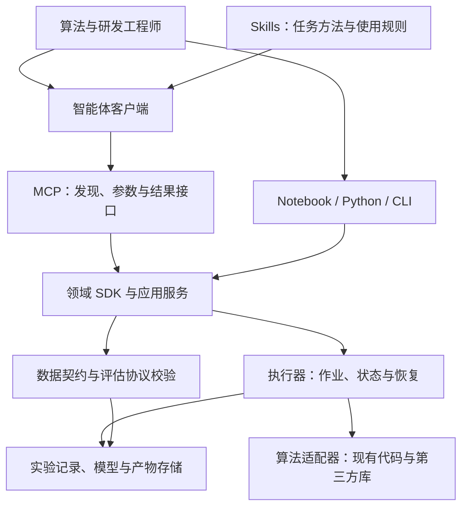

**面向故障预测、寿命预测与异常检测的智能体工具体系调研**  
Agent Skills 流程组织、MCP 能力封装与工作流架构比较

目标用户：算法/研发工程师。场景：离线分析、建模、验证和批量预测。

本文依据官方文档、公开仓库及本地技能说明进行技术调研。文中“已核实”指文档或公开实现中可确认的能力；“建议”属于面向本项目的架构判断；原型性能、兼容性及开发周期尚未实测。公开仓库主分支与 latest 文档会变化，实施时需固定发行版、依赖和协议版本。

**建议采用“领域 SDK + Skill + MCP 适配 + 可持久化执行”的组合，并为研发人员保留直接编程入口。** 核心资产是可测试的算法组件、数据语义、评估协议与实验记录。Skill 组织专家方法，MCP 负责向智能体暴露能力，执行服务保证任务状态与约束；Notebook、CLI 和后续界面复用同一核心。

本次调研得到的三个关键发现：

- MATLAB 的智能体生态包含两种封装：通用代码执行，以及将已有 MATLAB 函数发布为领域工具。两者适合的研发阶段不同。[MATLAB MCP Server](https://github.com/matlab/matlab-mcp-server)、[Production Server MCP Framework](https://github.com/matlab/mcp-framework-matlab-production-server)
- PyOD 3 已提供 `od-expert` Skill、MCP 与经典 Python API，是与你设想直接对应的开源参照；目前公开说明将 Skill 的多轮分析和 MCP 的无状态工具明确区分。[PyOD 官方仓库](https://github.com/yzhao062/pyod)
- MCP 已有长任务的 Tasks 扩展。工程选型应核对客户端支持，并将协议任务映射到自己的作业记录；底层计算恢复仍取决于执行器与持久化实现。[MCP Tasks 扩展](https://tasks.extensions.modelcontextprotocol.io/specification/2026-07-28/tasks)

**一、先统一四类任务的含义。** 本项目建议以设备时序与设备健康管理为范围，以结果的业务含义组织能力。

| 任务 | 回答的问题 | 数据和输出契约 | 需要特别验证的内容 |
|---|---|---|---|
| 异常检测 | 当前或某段时间是否偏离正常行为？ | 正常参考数据或混合无标签数据；输出分数、阈值、异常区间 | 无监督分数不能直接解释成故障概率；缺少真值时不能报告准确率 |
| 故障诊断 | 当前属于哪种已知故障？ | 已标注的设备状态；输出类别及其证据 | 分类正确不代表能够提前预警 |
| 故障预测 | 未来指定时间范围内是否发生故障？ | 历史观测、故障事件、观察结束时间；输出指定时间范围的风险 | 预测提前量、标签成熟时间、重复报警、随访不足 |
| 剩余寿命预测（RUL） | 在定义的失效条件下还可运行多久？ | 退化轨迹或带删失的事件时间；输出剩余时间及不确定性 | 时间单位、失效阈值、未来工况假设、未失效设备的处理 |

这些任务共享数据准备与特征工程，但标签、训练目标、评估方法和交付物不同。生存分析专门处理部分事件时间只能被观察到下界的删失数据；一般回归不能直接替代这类建模。[scikit-survival 官方说明](https://scikit-survival.readthedocs.io/en/latest/)

建议主流程为：明确任务与决策时点 → 数据契约检查 → 固定切分和评估协议 → 训练集内拟合预处理与模型 → 验证集选型/定阈值 → 独立测试 → 导出模型、配置、代码和报告。全量数据可以用于结构核查；影响模型选择的探索应限定在开发集。

**二、业界参照应分层比较。** 算法库、智能体接入层、工作流平台和实验管理工具解决的是不同问题。

| 参照对象 | 已核实能力 | 对本项目的借鉴 | 本项目仍需补足的部分 |
|---|---|---|---|
| MATLAB Predictive Maintenance Toolbox | 特征设计、异常/故障检测、RUL 估计、交互式应用、部署支持 | 以完整工程任务组织能力；同时提供函数、应用和示例 | 你的业务标签、数据语义与评估协议。[产品文档](https://www.mathworks.com/products/predictive-maintenance.html) |
| MATLAB Agentic Toolkit | 将领域知识与工作流组织为 Skills，并连接 MATLAB MCP Server | 按领域按需加载；把常见错误与使用边界写入 Skill | Skill 的采用效果需要自己的用例集验证。[官方仓库](https://github.com/matlab/matlab-agentic-toolkit) |
| MATLAB MCP Server | 执行代码、运行脚本与测试、静态检查、环境探测 | 少量通用工具配合成熟 SDK，支持探索性研发 | 生成代码的质量、实验隔离和数据切分仍需保证。[官方仓库](https://github.com/matlab/matlab-mcp-server) |
| MATLAB Production Server MCP Framework | 将 MATLAB 函数发布为 MCP 工具 | 把已经验证的函数变成稳定领域接口 | 所需产品、部署方式与客户端兼容性需逐项核对。[官方仓库](https://github.com/matlab/mcp-framework-matlab-production-server) |
| PyOD 3 | 检测器 API、ADEngine、od-expert Skill、MCP 工具 | 同一个分析核心支持代码、Skill 和 MCP 多入口 | 设备级时序切分、故障提前量、RUL 不是该案例直接证明的能力。[官方仓库](https://github.com/yzhao062/pyod) |
| aeon、tsfresh | 时序学习算法；特征提取/选择与 sklearn 管线集成 | 封装算法适配器，复用生态而非重写全部算法 | aeon 当前文档将异常检测等模块标为实验性；适配时固定版本。[aeon](https://www.aeon-toolkit.org/en/stable/)、[tsfresh](https://tsfresh.readthedocs.io/en/latest/text/sklearn_transformers.html) |
| scikit-survival、NASA ProgPy | 删失事件建模；工程系统预测、状态估计及不确定性传播 | 分别支持统计寿命分析与模型驱动预测 | 失效定义、数据适配和领域模型仍要自行建立。[scikit-survival](https://scikit-survival.readthedocs.io/en/latest/)、[ProgPy](https://github.com/nasa/progpy) |
| KNIME | 可复用的工作流组件、配置界面、Python 脚本集成 | 图形组件与代码共存，适合作为后续可视化设计参照 | 先验证现有工作流复用价值，再决定是否自建画布。[组件文档](https://docs.knime.com/ap/latest/analytics_platform_components_guide/)、[Python 集成](https://www.knime.com/knime-python) |
| Prefect、LangGraph | 计算工作流的状态/重试；智能体流程的检查点与持久化 | 区分“计算作业执行”与“智能体决策循环” | 两层状态的关联及幂等需要设计。[Prefect](https://docs.prefect.io/v3/concepts/tasks)、[LangGraph](https://docs.langchain.com/oss/python/langgraph/persistence) |
| MLflow | 实验参数、指标和产物跟踪；模型版本及来源管理 | 复用实验追踪与模型登记能力 | 记录数据并不自动保证无泄漏和可复现，还需平台约束。[Tracking](https://mlflow.org/docs/latest/ml/tracking/)、[Registry](https://mlflow.org/docs/latest/ml/model-registry/) |

**MATLAB 案例的设计启示。** 应分别研究领域算法、经验说明、执行接口与交互式应用。官方 Toolkit 建议按需要安装技能组，这支持“少量任务入口 + 按需参考资料”的组织方式。它不意味着每个算法都必须成为独立 MCP 工具。[MATLAB Agentic Toolkit](https://github.com/matlab/matlab-agentic-toolkit)

本地抽样阅读的旋转机械特征、信号准备和表格分类 Skill，还展示了三种有价值的写法：记录物理参数前提；用参考文件拆分长流程；将重复计算和模型目录放入脚本。这里仅将这些文件作为设计样本，没有执行其工作流。面向设备预测时，表格分类的默认切分、信号清洗的去趋势/去异常规则都必须结合预测任务重新判断：退化趋势和异常冲击可能正是目标信号。

**PyOD 案例的设计启示。** 公开 README 描述 MCP 当前提供十个无状态工具，覆盖知识查询、规划、检测与结果分析；有状态的 `investigate`/`iterate` MCP 工具仍列为后续内容。其 Skill 则可通过 Python ADEngine 驱动多轮分析。因此，“有 Skill、有 MCP”不能等同于“各入口支持完全相同的状态与任务能力”。[PyOD README](https://github.com/yzhao062/pyod)、[od-expert 工作流源码](https://github.com/yzhao062/pyod/blob/master/pyod/skills/od_expert/SKILL.md)

建议复用这种多入口设计，重点自研设备与时间语义、评估协议和实验留痕。以上资料并未证明某种封装可以提高你的模型精度，仍需要对照实验。

**三、技术路线比较。** 下表是针对研发工程师的定性判断，属于设计分析，不是性能实测。MCP、SDK 与工作流引擎可以组合。

| 路线 | 研发自由度 | 稳定验证与复现 | 首版投入 | 主要适用条件 | 建议 |
|---|---|---|---|---|---|
| Skill + 通用代码执行工具 | 高，可随任务生成代码 | 依赖环境锁定、导出代码和验证器 | 较低 | 算法探索、快速复现论文、临时特征 | 保留为探索入口 |
| Skill + 领域 MCP 工具 | 受组件目录约束 | 契约与约束容易统一，仍需记录运行状态 | 中等 | 反复出现的标准分析与模型比较 | 作为标准流程入口 |
| Skill + SDK/CLI/API | 高，复用现有代码 | 取决于核心 SDK 和运行记录设计 | 较低至中等 | 单一研发环境、已有 Python/MATLAB 工程 | 作为首版的基础与最简基线 |
| Skill + 领域工具 + 执行器 | 高层灵活、运行过程明确 | 可集中管理状态、恢复与实验协议 | 中等至较高 | 长训练、批量实验、跨会话复用 | 推荐目标组合，逐步建设 |
| 可视化工作流平台 + 自定义组件 | 节点内可编程，图结构明确 | 取决于平台和组件实现 | 采用现成平台中等；自建较高 | 团队已有平台，或图形协作价值显著 | 作为替代方案及后续入口 |

建议决策顺序：先确定核心 SDK 与数据契约 → 在一个真实任务上比较直接调用和 MCP 调用 → 固化反复出现的流程 → 根据长任务和多人协作需求选择执行器。若一个 Skill 调用版本化 CLI 就能满足需要，首版可采用该路径；当跨客户端接入、能力发现或远程服务价值明确时，再增加 MCP 适配。

建议先使用现有智能体客户端，不在首版自建聊天系统。若需要自主维护复杂、跨会话的分析决策循环，再评估 LangGraph；若需求主要是训练排队、重试、缓存和批量执行，优先评估计算工作流执行器。LangGraph 的检查点和 Prefect 的任务状态是不同层次的能力，不能直接相互替代。[LangGraph 持久化](https://docs.langchain.com/oss/python/langgraph/persistence)、[Prefect 任务](https://docs.prefect.io/v3/concepts/tasks)

**四、推荐的职责划分。** 下图与接口名称均为本项目建议方案。

| 层次 | 应承担的职责 | 应交给其他层的内容 |
|---|---|---|
| Skill | 任务识别、前置知识、方法选择、结果解释、失败后的诊断路径 | 参数合法性和禁止泄漏等硬约束由程序执行 |
| 智能体 | 理解目标、形成实验方案、调用工具、提出解释与下一步实验 | 数值计算和真实运行状态由服务返回 |
| MCP 适配 | 可发现的工具、输入输出 schema、结构化错误、资源引用 | 核心算法及业务状态保留在 SDK/服务中 |
| 领域 SDK | 组件接口、数据语义、标签、模型管线、指标与统一业务服务 | 传输协议不进入算法实现 |
| 执行器 | 排队、资源限制、状态、取消、重试、进程故障后的处理 | 分析方法由 Skill 和实验配置表达 |
| 实验与产物存储 | 数据/配置/代码版本、切分、模型、指标、图表及日志 | 原始数组按文件或对象引用保存 |

Skill 的按需加载、脚本与参考文件结构有官方格式依据；以上分层是本调研的工程建议。[Agent Skills 规范](https://agentskills.io/specification)

对研发用户，建议每次实验都能导出“代码或可执行配置 + 环境锁定文件 + 数据指纹 + 切分清单 + 结果”。固定流水线可由配置重放，自定义算法同时保存源码或已安装包版本。代码入口与 MCP 入口调用同一业务服务，避免维护两套行为。

**五、Skill 与 MCP 的首版范围。** 以三个任务 Skill 为主入口，加两个通用 Skill；共享阶段知识放入参考文件，避免每个微小步骤都独立触发。

| 建议 Skill | 使用目标 | 必须交付 |
|---|---|---|
| `phm-anomaly-analysis` | 正常建模、异常区间分析、阈值比较 | 参考集说明、分数定义、异常区间、阈值来源、验证限制 |
| `phm-failure-forecast` | 未来固定时间范围的故障预测 | 预测时间范围、事件标签、切分协议、误报与提前量 |
| `phm-rul-analysis` | 退化回归或删失寿命分析 | 失效定义、时间单位、删失说明、预测及不确定性 |
| `phm-data-audit` | 数据进入建模前的审查 | 通道质量、时间/设备角色、单位、数据可用性 |
| `phm-reproduce-experiment` | 重放、导出、对比既有实验 | 完整清单、版本一致性、指标差异及原因 |

建议 MCP 首版提供约 15 个稳定工具，覆盖能力发现、数据注册与概览、实验创建/校验、提交/查询/取消/重试、产物读取、运行比较、导出和批量推理。几十种算法作为可查询组件存在；批量配置与执行通过实验规格表达，减少大量零碎调用。详细清单和对象草案见同目录的《Skill_MCP设计与验证草案.md》。

工具返回建议统一为：标识符、状态、简短摘要、警告、结果引用、错误码。结构化输出和资源链接有 MCP 规范支持；业务字段和语义由本平台定义。[MCP Tools 规范](https://modelcontextprotocol.io/specification/2026-07-28/server/tools)

长任务采用“提交返回 run_id → 查询状态 → 读取结果”的业务接口。有 Tasks 扩展支持时，可在适配层映射到协议任务；不支持时仍能使用普通工具完成查询。客户端请求超时只说明本次调用未及时返回，不能据此创建重复训练或判定作业失败。协议兼容性按选定客户端与 SDK 实测。[MCP Tasks 扩展](https://tasks.extensions.modelcontextprotocol.io/specification/2026-07-28/tasks)

**六、最值得自研的是领域约束。** 以下为本项目建议固化的校验规则。

| 问题 | 应固化的机制 | 原因 |
|---|---|---|
| 重叠窗口、同一设备被随意拆到训练与测试 | 显式设备/时间切分，记录原始观测与标签时间范围 | 防止把相邻片段记忆当成泛化 |
| 归一化、插补、PCA、特征选择见过测试数据 | 学习型处理在每个训练折内 fit，验证/测试只 transform | 管线管理必须覆盖预处理阶段 |
| 利用未来信息构造输入 | 检查决策时点可用性；审查双向插值、居中窗口与未来标签 | 离线可计算不代表预测时可获得 |
| 将随访不足样本当成“未来无故障” | 标签记录观察截止；负类要求完整观察预测时间范围 | 防止错误负标签 |
| 无标签检测结果被描述为高准确率 | 区分描述性评分、代理质量和有真值的测试指标 | 模型一致性不是故障真值 |
| RUL 的风险分数被当成小时数 | 输出类型分开；记录失效定义、时间单位、删失与未来工况 | 风险排序与剩余时间估计含义不同 |
| 去异常或去趋势删除了故障信息 | 原始数据保留；变换记录理由、参数与影响 | 预处理应受任务目标约束 |
| 重试产生重复实验、旧缓存复用错误结果 | 幂等提交；缓存键含数据、配置、代码、环境与切分版本 | 运行可靠性直接影响结论 |

训练/测试分离与训练集内拟合预处理有明确方法依据；上述设备时间规则是针对本项目的进一步设计。[scikit-learn 常见陷阱](https://scikit-learn.org/stable/common_pitfalls.html)

对于删失寿命模型，应按输出选择 C-index、时间相关判别指标、Brier score 等；仅用已失效设备的 RUL 平均误差不能概括含删失设备群体的表现。[生存模型评估](https://scikit-survival.readthedocs.io/en/stable/user_guide/evaluating-survival-models.html)

**七、现有本地说明提供了一个可利用的起点。** 当前环境中存在 `fault-prediction/SKILL.md` 及组件参考文件。以下仅依据所读文档，未检查平台源码或调用实时 schema，也不据此认定当前服务能力。

| 文档中可见的设计 | 建议保留或改进 |
|---|---|
| Skill 组织数据准备、质量、窗口、特征、验证、执行与交接 | 保留阶段结构，并在任务入口区分异常、预测、RUL |
| 组件图有类型端口、批量编辑和结构校验 | 可作为领域 SDK/执行核心的接口基础 |
| 支持资产/时间相关验证、结果摘要、XML 与 Python 导出 | 保留并加强数据版本、切分和环境记录 |
| 状态、工作区、检查点被描述为进程内保存 | 如果仍然如此，优先增加持久化运行记录与崩溃恢复；保存图不等于保存训练结果 |
| 文档明确 PCA/特征选择存在全量拟合的探索性限制 | 为正式验证增加训练折内拟合的转换器契约 |
| 已读目录未见完整的 RUL/删失寿命任务契约 | 将其列入实时能力核验清单，不能仅用现有回归组件宣布已覆盖寿命预测 |

若该平台就是当前项目，适合按“补协议、补状态、补验证、增加任务 Skill”的顺序演进。若它只是已有样例，可用作组件式 MCP 的设计对照。

**八、验证应分为算法层和智能体层。** 先固定同一数据、切分、算法目录与预算，再比较不同入口和编排方式。否则无法判断收益来自封装、模型更换还是更大的调参预算。

| 对照组 | 用途 |
|---|---|
| 人工编写、经过复核的 SDK 脚本 | 提供正确执行与产物的参照 |
| 同一智能体 + 通用代码工具，无领域 Skill | 测量直接生成代码的基线 |
| 同一智能体 + Skill + SDK/CLI | 估计领域知识和流程说明的增益 |
| 同一智能体 + Skill + MCP，调用同一核心 | 估计接口形式、参数约束与接入成本的影响 |
| 在上一组上增加持久化执行器 | 单独评估长任务、故障恢复与批量运行收益 |

算法层衡量事件召回、误报负担、提前量、RUL 误差与区间质量等；智能体层衡量任务正确完成率、错误调用、人工干预、复现成功率、时间和 token 成本。无标签案例考察流程质量及诚实报告，不能强行计算预测性能。

**九、实施路线建议按可验收阶段推进。** 时间是规划估计，假设已有可运行算法、由一名算法工程师和一名平台工程师协作；真实数据适配、许可证采购、在线部署和算法创新另计。

| 阶段 | 规划时间 | 主要产物 | 退出条件 |
|---|---|---|---|
| P0：能力盘点与协议 | 约 1 周 | 一个代表数据集、任务定义、SDK 入口、切分和产物规范 | 人工脚本可重放；任务语义被固定 |
| P1：单任务最小闭环 | 约 1–2 周 | 数据审查 + 一个任务 Skill；MCP/CLI 适配；运行清单和导出 | 一次从数据到结果的实验可脱离聊天重放 |
| P2：恢复与对照验证 | 约 1–2 周 | 幂等提交、取消/重试、持久状态、智能体评测集 | 故障注入和数据泄漏用例按预期通过/拒绝 |
| P3：扩展任务 | 约 2–3 周 | 另外两个任务 Skill、RUL/删失适配、模型比较 | 三类任务均有代表数据和可复现实验 |

阶段可交叠，总体粗估约 5–8 周形成研发试用版；若现有平台已具备组件图、执行器和导出能力，应重新盘点后缩减范围。首个任务按数据条件选择：正常数据充分而故障标签不足时做异常检测；事件定义清晰时做故障预测；有全寿命/删失记录时做 RUL。

建议优先复用算法库、MCP SDK、实验追踪和现成客户端；自研设备数据契约、时间标签、评估协议、算法适配和任务 Skills。可视化画布、大规模调度与在线系统等到研发闭环验证后再投入。

**十、成本和选型的具体判断。** 已有大量 MATLAB 算法时，保留其后端往往更符合迁移成本；新建且需要广泛 Python 扩展时，Python SDK 可作为首选原型。两种后端可共存，但第一版只实现一个，以控制适配成本。

| 成本项 | MATLAB 路线 | Python 组件路线 |
|---|---|---|
| 算法与领域经验 | 可复用成熟工具箱与既有代码 | 可组合开源库，但需要统一数据和评估 |
| 运行与部署 | 取决于所需工具箱及部署产品 | 取决于环境、算力和服务维护 |
| 自定义算法 | MATLAB 函数或混合语言适配 | Python 插件/包直接接入较自然 |
| 团队服务化 | 核对所用产品和 MCP 方式的许可条件 | 核对固定版本及传递依赖许可 |
| 长期维护 | 产品版本与接口适配 | 多库升级、兼容性和算法行为回归 |

MATLAB MCP Server 当前 README 明确限定不能由多个用户共享，集中式使用需联系 MathWorks；不能把桌面 MCP 接入直接视为团队共享服务授权。Production Server 框架是另一条产品路径，应按其要求评估。[MATLAB MCP 使用说明](https://github.com/matlab/matlab-mcp-server#licensing-and-usage)、[Production Server 框架要求](https://github.com/matlab/mcp-framework-matlab-production-server#required-products)

